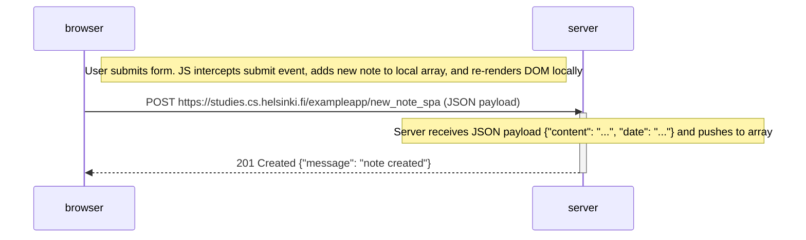

```mermaid
sequenceDiagram
    participant browser
    participant server

    Note right of browser: User submits form. JS intercepts submit event, adds new note to local array, and re-renders DOM locally

    browser->>server: POST https://studies.cs.helsinki.fi/exampleapp/new_note_spa (JSON payload)
    activate server
    Note over server: Server receives JSON payload {"content": "...", "date": "..."} and pushes to array
    server-->>browser: 201 Created {"message": "note created"}
    deactivate server
```